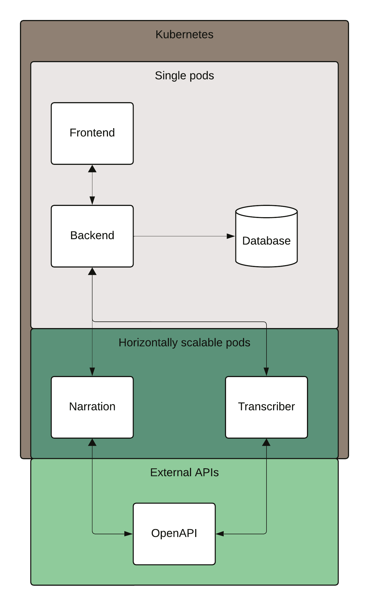

# The Tranator

## Overview

- **What does it do?:**
The app can Narrate text and Transcribe speech. The narrator takes text as an input and outputs a WAV file, while the transcriber records audio directly in the browser and returns text.
- **What problems does it solve?:**
For example: Writing down what is been said in a meeting, or read something aloud for a friend when you have a sore throat.
- **Who is it for?:**
Anyone that would want to turn speech in to text or the other way around.
The use case is quite broad and therefore could be used by most people

## Architecture & Components

### High-Level Design
- The frontend (Nuxt 3) communicates with the backend (Express) via RESTful APIs.
- The backend orchestrates communication with the Postgres database and the two microservices.
- The two microservices (Transcription & Narration), built with FastAPI, run independently and scale independently.
- The entire system runs on Kubernetes which provides scalability, resilience, and ease of deployment.

### Components and Their Responsibilities
- **Frontend (Nuxt 3):**
Renders UI, handles user navigation, and sends user requests to the backend.

- **Backend (Express.js):**
Acts as a gateway and orchestrator. Handles requests from the frontend, integrates results from the microservices, and interacts with the database.

- **Database (Postgres):**
The database saves the input text as logs for the system. This can later be used to identify the use cases.

- **Transcription Microservice (FastAPI):**
Takes audio input, performs speech-to-text conversions, and returns transcribed text.

- **Narration Microservice (FastAPI):**
Generates audio narrations from given text, returning audio.

### Architecture Principles Used
- **Microservices Pattern:** Each service is independent, allowing scaling and updates without affecting others.
- **API Gateway Pattern:** The backend (Express) acts like a gateway, simplifying interactions for the frontend and injecting database logic.
- **Containerization & Orchestration:** Enables easy scaling, consistent environments, and standardised hosting.

## Benefits & Challenges

### Benefits
- **Scalability:** Individual services can scale as needed without impacting the entire system.
- **Flexibility:** Independent microservices reduce coupling and allow different technologies for each component.
- **Maintainability:** Smaller, specialized codebases are easier to understand and update.
- **Cloud-Native Capabilities:** Kubernetes simplifies deployments, scaling, and monitoring.

### Challenges
- **Complexity in Deployment:** Multiple services, containers, and configurations can be harder to manage than a monolith.
- **Service Communication & Network Overhead:** More network calls between services can introduce latency and raises the knowledge floor a fair bit.

### Possible Mitigation Strategies
- **Automated CI/CD Pipelines:** Quickly test and deploy changes, ensuring quality and security checks are in place. But once again this comes with a lot of setup overhead and requires special knowledge.
- **Caching and Load Balancing:** Performance can be improved and latency reduced by strategically caching responses. Responses that are more popular can be identified using the logging system and be prioritzed to save.
- **Rate Limiting & Throttling:** Automatic scaling can be dangerous without enforced limits. especially in systems accessible by many.

## Conclusion & Future Work
The webapp in it's current state lacks a lot of functionality because the use case is loosely defined. Since it's not tailored towards any specific user group, it could be improved in functionality if it was specifically made to take meeting notes for example. However keeping the use case this broad will enable a lot of different user groups to utilize the functionalities.

Developing support for many additional input formats would vastly increase usability as the text can originally be inside a pdf for example. Implementing caching for the narator and transcriber is a good next step for the application if cost minimization is important. This would reduce load of the services and reduce costs towards the external API. The AI microservices could also be inferenced instead of relying on a 3rd party API.

Nginx hides the backend and AI services behind a single entry point. Those pods are only accessible through the frontend pod.

The resource intensive AI microservices can easily be extended to allow for more functionality in the webapp. If a new frontend is desired, nuxt can be easily swapped for another framework without without affecting the AI microservices.

## Getting Started (Optional)
- **Prerequisites:** Tools and versions required.
* OpenAI API key
* Bash (or something else that can run bash scripts)
* Minikube (Optional: Needed for the start.sh)
* Kubernetes
* Docker
- **Installation & Deployment Instructions:** Steps to run locally or deploy to Kubernetes.
* Create a .env file in narrator/ and transcriber/ directories. The .env should contain: OPENAI_API_KEY=<insert key>
* cd deployment/scripts
* Run bash script in ./start.sh

**Happy coding!** ✨
